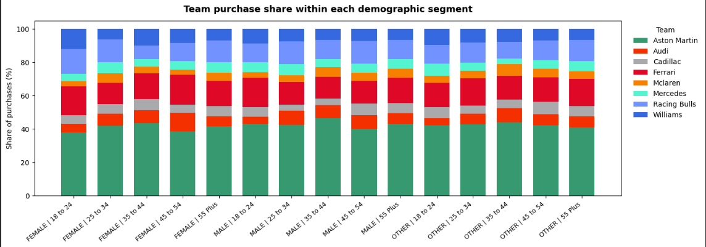
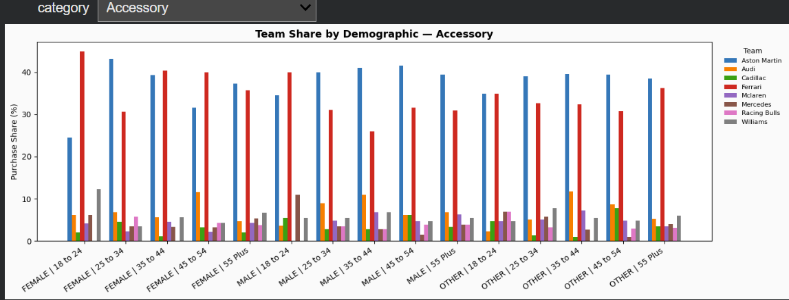

# F1 Merchandise Demographic Segmentation Pipeline

This repository contains my individual contribution to a group data engineering 
project completed for SYS 2202 (Data & Information Engineering) at the University 
of Virginia (Fall 2025).

## Project Overview
The larger project built an end-to-end data pipeline for a simulated F1 merchandise 
storefront, analyzing how race performance influences consumer purchasing behavior. 
My contribution focused on **Objective 3: Identifying demographic differences in 
team merchandise preferences** across gender and age segments.

## My Contribution
- Designed and implemented an ETL/ELT pipeline joining 5 relational tables to 
  connect customer demographic data with purchasing behavior
- Engineered feature standardization across gender, category, and team name fields 
  to ensure data consistency before analysis
- Applied demographic segmentation and produced 2 interactive stacked bar chart 
  visualizations surfacing which F1 teams dominated each demographic segment
- Analyzed purchasing patterns across 5 merchandise categories to support targeted 
  inventory and personalization decisions

## Tech Stack
- Python (pandas, matplotlib)
- SQL (MySQL)
- Google Colab
- ETL/ELT pipeline design

## File
- [objective3_demographic_segmentation.ipynb](objective3_demographic_segmentation.ipynb) — full pipeline

## Visualizations

**Team Merchandise Preferences by Demographic**

**Team Purchases by Category and Demographic**

## Note
Data used in this project was simulated to replicate realistic F1 merchandise 
purchasing behavior. All analytical logic, pipeline implementation, and 
visualizations were completed independently.
